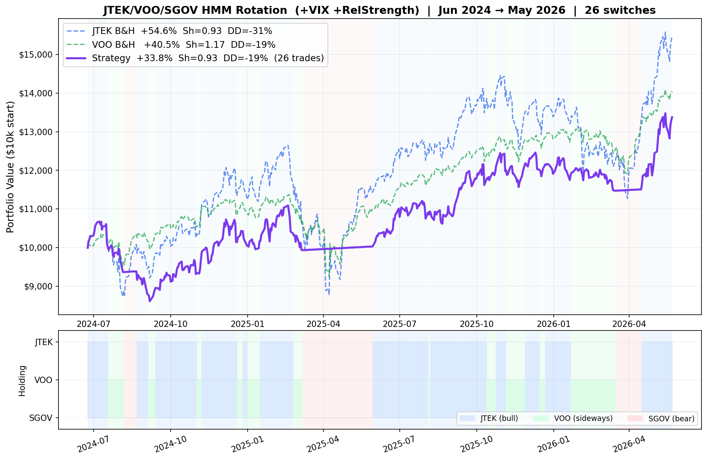

# JTEK/VOO/SGOV Rotation Bot

Daily Telegram signal bot that uses a 3-state Hidden Markov Model to detect equity market regimes and recommend which ETF to hold.

## Strategy

| Regime | Hold | Logic |
|--------|------|-------|
| 🟢 Bull | JTEK | Low volatility, positive trend, calm tech outperformance |
| 🟡 Sideways | VOO | Neutral conditions — broad market exposure |
| 🔴 Bear | SGOV | High volatility + negative trend — park in T-bills |

**JTEK** — JPMorgan U.S. Tech Leaders ETF (actively managed, high-beta tech)  
**VOO** — Vanguard S&P 500 ETF  
**SGOV** — iShares 0-3 Month Treasury Bond ETF (~4-5% yield, near-cash)

## How it works

The HMM is trained on **3 years of daily VOO data** using five z-scored features:

1. **5-day log return** — short-term momentum (less noisy than daily)
2. **20-day realised volatility** — regime volatility level
3. **Price vs 200-day SMA** — long-term trend signal
4. **VIX vs 60-day mean** — market fear/uncertainty
5. **JTEK/VOO relative strength** — tech outperformance signal

States are ranked by `trend_z − vol_z`: rewards calm uptrends (→ JTEK), penalises volatile downtrends (→ SGOV).

## Backtest (May 2024 → May 2026)



| Variant | Total Return | Sharpe | Max DD |
|---------|-------------|--------|--------|
| **Strategy (+VIX+RS)** | **+33.8%** | **0.93** | -19.3% |
| VOO B&H | +44.4% | 1.23 | -18.7% |
| JTEK B&H | +57.2% | 0.94 | -30.6% |

The strategy trails buy-and-hold in a strong bull market but cuts max drawdown nearly in half vs JTEK. Value shows up most in sustained bear markets by parking in SGOV.

> ⚠️ Backtest uses the same period as training (look-ahead bias). Out-of-sample performance will differ.

## Signals

A systemd timer fires daily at **22:00 Oslo time** (after US market close):

- **Regime change alert** — fires immediately when regime flips, with explicit "Switch X → Y" action
- **Daily summary** — current regime, state probabilities, ETF prices, VIX level, last 10 days of history

## Installation

```bash
cd jtek-bot
bash install.sh
```

The install script will:
- Install Python dependencies (`yfinance`, `hmmlearn`, `pandas`, `numpy`, `requests`)
- Prompt for your Telegram bot token and chat ID
- Install and enable a systemd user timer

## Manual test run

```bash
python3 runner.py
```

## Logs & status

```bash
tail -f ~/.config/jtek-bot/jtek-bot.log
systemctl --user status jtek-bot.timer
cat ~/.config/jtek-bot/state.json
```

## Config

Edit `~/.config/jtek-bot/config.json`:

```json
{
  "telegram_token": "...",
  "telegram_chat_id": "...",
  "lookback_days": 756,
  "n_states": 3,
  "n_restarts": 20
}
```

## Requirements

- Python 3.10+
- `yfinance`, `hmmlearn`, `pandas`, `numpy`, `requests`
